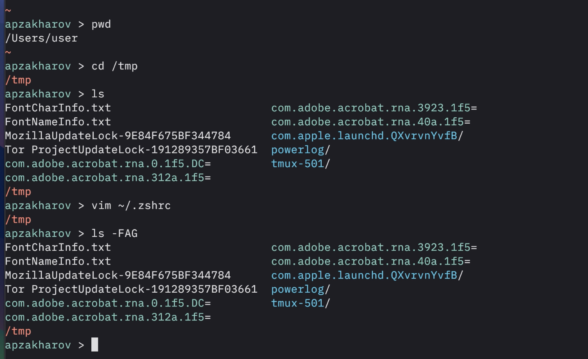
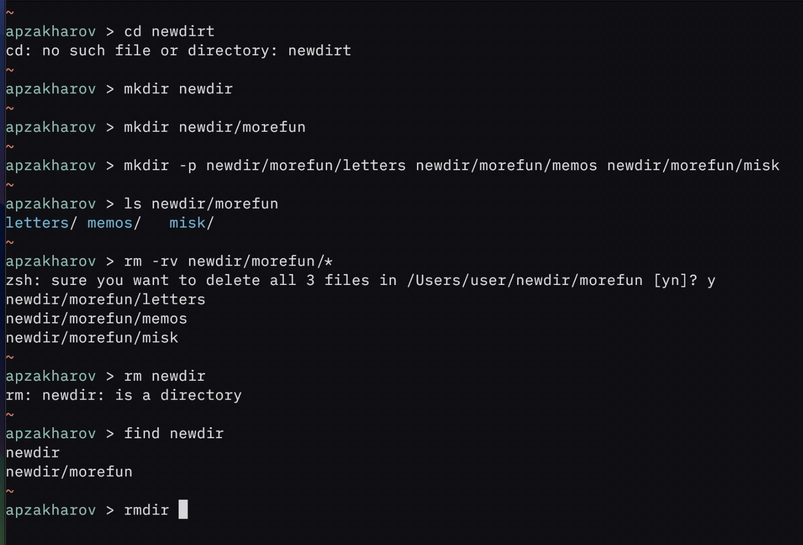

---
## Front matter
lang: ru-RU
title: Лабораторная №6
subtitle: Отчёт-презентация
author:
  - Захаров А.П.
institute:
  - Российский университет дружбы народов, Москва, Россия
date: 16 марта 2024

## i18n babel
babel-lang: russian
babel-otherlangs: english

## Formatting pdf
toc: false
toc-title: Содержание
slide_level: 2
aspectratio: 169
section-titles: true
theme: metropolis

## Fonts
mainfont: PT Sans
romanfont: PT Serif
sansfont: PT Sans
monofont: PT Mono
mainfontoptions: Ligatures=TeX
romanfontoptions: Ligatures=TeX
sansfontoptions: Ligatures=TeX,Scale=MatchLowercase
monofontoptions: Scale=MatchLowercase,Scale=0.9

header-includes:
 - \metroset{progressbar=frametitle,sectionpage=progressbar,numbering=fraction}
 - '\makeatletter'
 - '\beamer@ignorenonframefalse'
 - '\makeatother'

---

# Информация

## Докладчик

:::::::::::::: {.columns align=center}
::: {.column width="70%"}

  * Захаров Александр Петрович
  * студент
  * Российский университет дружбы народов
  * [a.zaxapov@yandex.ru](mailto:a.zaxapov@yandex.ru)

:::
::::::::::::::

# Задание

Разобраться в работе UNIX подобных системах с помощью командной строки.

# Цель работы

Пройти основы интерфейса взаимодействия пользователя с системой Unix на уровне командной строки

# Выполнение лабораторной работы

## Шаг 1

Продемонстрировал команды `pwd, cd, ls`.

{#fig:001 width=70%}

## Шаг 2

Удалял и создавал директории

{#fig:002 width=70%}

## Шаг 3

Просмотрел историю с помощью `history`.

{#fig:003 width=70%}

# Выводы

Во время выполнения лабораторной работы я углубил свои знания системных команд UNIX.
